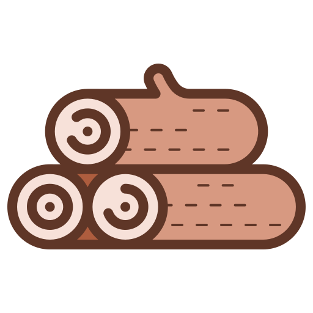
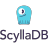

## Hi there, I'm Harshit 👋

<!-- []  -->

## 🙋‍♂️ About me

📜 I'm from India 🇮🇳 working in Germany 🇩🇪 as a Lead Engineer in IBM Instana's Application Reading team.  
💼 Backend developer by heart!  
 Currently working in the observability domain.   
🧐 Love geeking out over distributed systems.  
☕ Always up for a conversation and a coffee.

## 🔨 I've contributed to
Icons are clickable

## ✍️ I've written about

- Hedged Reads in Java - https://medium.com/@atpugtihsrah/hedged-read-in-java-c6f1d3296d19

## 🛠  Tech Stack

- **Development:** 
    
    
 - **Framework:** 
   
 - **Databases:** 
   
   
   
   
- **Message Brokers:** 
   
   
 - **Infrastructure:** 
   
   
   
 - **Monitoring:** 
   
   
   
   
 - **Tools:** 
   
   
   
   
 - **Know my way around:** 
   
   
   
   

<!--  -->

<!--
**atpugtihsrah/atpugtihsrah** is a ✨ _special_ ✨ repository because its `README.md` (this file) appears on your GitHub profile.

Here are some ideas to get you started:

- 🔭 I’m currently working on ...
- 🌱 I’m currently learning ...
- 👯 I’m looking to collaborate on ...
- 🤔 I’m looking for help with ...
- 💬 Ask me about ...
- 📫 How to reach me: ...
- 😄 Pronouns: ...
- ⚡ Fun fact: ...
-->
